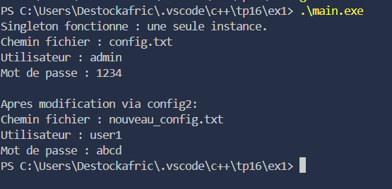
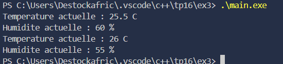
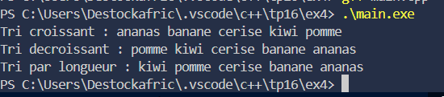

### TP C++ – Patrons de Conception

---

### Exercice 1 – Singleton

#### Objectif
Gérer une configuration globale dans une application en garantissant qu'une seule instance soit créée pour centraliser les paramètres et éviter les conflits.

#### Description
Implémentation du patron Singleton pour stocker et gérer des paramètres comme le chemin de fichier, l’utilisateur ou le mot de passe. La classe Configuration empêche la création de multiples instances et fournit un accès centralisé aux paramètres.

#### Fonctionnalités
- Création unique de l'instance avec `getInstance()`.
- Constructeur privé pour empêcher l'instanciation directe.
- Suppression du constructeur de copie.
- Méthode pour afficher les paramètres de configuration.
- Possibilité de modifier les paramètres via des setters.

---

### Exercice 2 – Factory Method

#### Objectif
Permettre la création dynamique d'objets de type Cercle, Carré ou Triangle sans modifier le code client.

#### Description
Création d'une classe abstraite `Forme` et de classes concrètes `Cercle`, `Carré` et `Triangle`. Une fabrique `FabriqueForme` instancie la forme demandée selon un paramètre fourni par l'utilisateur.

#### Fonctionnalités
- Interface Forme avec méthode virtuelle `afficher()`.
- Classes concrètes implémentant Forme.
- Fabrique pour créer des objets dynamiquement selon un type.
- Polymorphisme et encapsulation des types de formes.
- Extension facile avec de nouvelles formes.

---

### Exercice 3 – Observer

#### Objectif
Mettre à jour automatiquement plusieurs affichages lorsqu'une station météo change ses données.

#### Description
Implémentation d'une classe `StationMeteo` qui notifie ses observateurs lors des changements de données. Plusieurs affichages (température, humidité, etc.) reçoivent les mises à jour dynamiquement grâce au patron Observer.

#### Fonctionnalités
- Classe StationMeteo servant de sujet.
- Interface Observateur avec méthode `mettreAJour()`.
- Classes d'affichage pour température et humidité.
- Notification automatique des observateurs à chaque changement.
- Support de multiples observateurs simultanés.

---

### Exercice 4 – Strategy

#### Objectif
Permettre de changer dynamiquement la stratégie de tri appliquée à un vecteur de données selon différents critères.

#### Description
Création d'une interface `StrategieTri` et de plusieurs stratégies concrètes (`TriCroissant`, `TriDecroissant`, `TriParLongueur`). La classe `GestionnaireTri` applique la stratégie active pour trier les données et permet de la modifier à l'exécution.

#### Fonctionnalités
- Interface `StrategieTri` avec méthode `trier`.
- Stratégies concrètes pour différents critères de tri.
- GestionnaireTri pour appliquer la stratégie choisie.
- Possibilité de changer la stratégie à tout moment.
- Affichage du vecteur après chaque tri pour visualiser le résultat.

